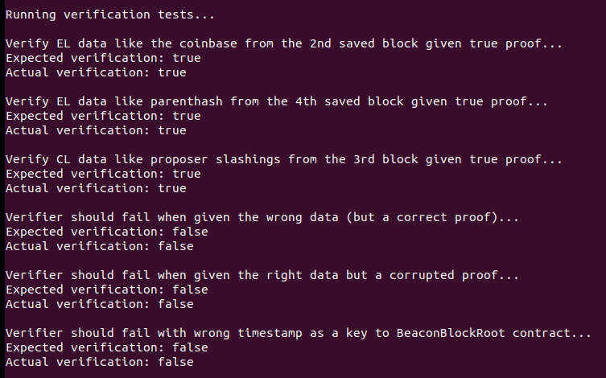
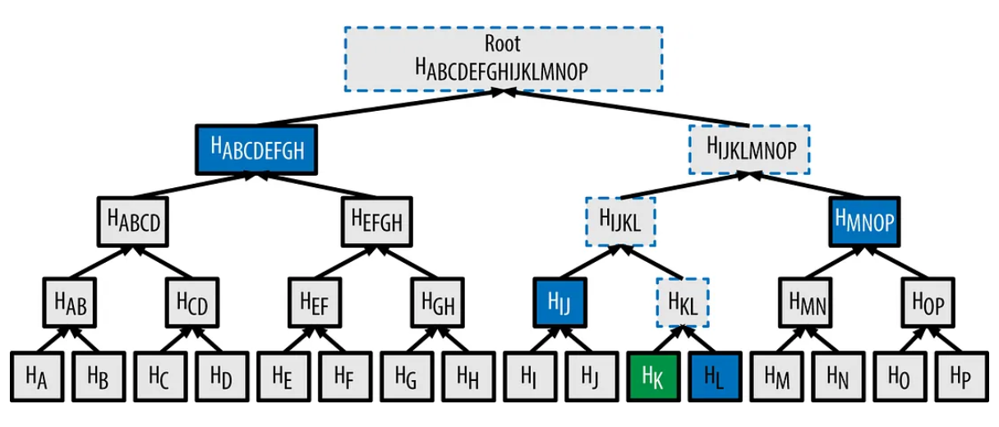

# OnChain Data Verification via Beacon Roots DEMO 

This is a demo of an onchain verifier contract getting offchain EL and CL data with merkle proofs and deciding if it is true or not by interacting with another onchain contract which stores beacon block merkle roots according to EIP-4788.

All you need to have installed is `docker` and `make`

Run `make build` (~30 sec) to prepare all contracts and build the execution docker image
Then `make run` to see tests run where the contracts interact in a simulated evm blockchain

# Theory and Design Behind EIP-4788

In a Merkle tree the data from each child branch are one-way hashed (ie. cryptographic hash like sha256), combined, and then the hash of the combination is the value at that parent branch.  This happens from the leaf nodes all the way to the single value produced at the root.  Because changing even one bit of a value completely changes the hash, any change to the data will cause that node and all nodes on the path up the tree to the root to change their hash values as well.  More usefully, because good cryptographic hashes are one-way and sensitive to small changes, it allows you to check if a specific piece of data is in the tree with just a few of the values up to the root, and this doesn't leak any information about what else may or may not be in the tree.

Therefore if the value at the root is known, to check if a specific leaf value is present you would just need a few of the hashes between your value and the node to figure this out.  EIP-4788 proposes publishing this node hash for beacon blocks in a publicly accessable contract and the "proof" that a claimed value is in the data is just these few additional in between node hash values.  For example, to verify value K in the diagram given the root hash you only need the 4 values at (H_L, H_IJ, H_MNOP, H_ABCDEFGH) since you can compute the hashes and combinations upto and including the root hash with this info. These 4 values in this specific order would be the merkle proof.

The BeaconBlock struct has a field called body which is a BeaconBlockBody struct.  In turn the BeaconBlockBody struct has a field called ExecutionPayload (which is similar to the eth1 original information).  If you have the root hash of the BeaconBlock struct, then you can verify any single (or multiple) fields in these children structs as they will all be part of the tree.  Notice this spreads across info in the consensus layer and the execution layer and can verify fields from both even though this was hard before because they are literally different blockchains and require different clients to have full access to the state data.  EIP-4788 wants to add the root hash info the ExecutionPayloadHeader (not the ExecutionPayload itself or you would have a circular computation problem), and make this publically accessable using the timestamp as a key to look up a given block's tree's root hash.

Although the date for it to be active according to the FORK_TIMESTAMP in the spec has passed a few months ago, it is not fully implemented in all clients yet.  This demo is just a partial implementation with focus on the core part of the full design working to proof of concept the ability for onchain contracts to use it to prove their desired data.

# Simplifications and Future Improvements

1. SimplifiedBeaconBlock

For the purposes of time and code complexity for this demo, instead of the actual full BeaconBlockBody, ExecutionPayload etc. nested structs, this demo imagines a single more basic data type called a SimplifiedBeaconBlock with just some of the fields from different of these real structs.

2. Data Types and edge cases

SimplifiedBeaconBlock avoids different data types, especially ones which would be variable length and need to be chuncked in the implementation of real SSZ and instead has every field be a 32 byte long string treated as a single leaf node when building the merkle tree.  Additionall there are 16 fields as a power of two to purposefully avoid the complexities of what to do when the tree is not complete.  All of this would have to be handled in a full real implementation of course.

3. Standin Random Data from CL

Real data from the EL of this simulated blockchain is used for some fields in the SimplifiedBeaconBlock, but any fields which would come from the CL structs is generated randomly since there isn't a CL client setup in this demo.  This shouldn't matter at all for the high level proving properties, but the blocks are not necesarrily self consistent with real data for the demo.

4. Beacon Block Roots contract get() and set()

The real spec only would allow the contract owner to set but any other address automatically get().  The BBR contract for this demo just exposes a slightly sloppier API but the basic idea is still the same and shouldn't affect the overall goal.  It also implements the ring buffer for timestamps and root values slightly differently as 2 separate buffers but overall it works the same to avoid empty "missed slots"

5. Single Field Merkle Proofs and Verifications

The SSZ spec allows for multiple fields at the same time in a multiproof but this is more complicated by a good amount

With more time there are a few code improvements for the future:
- implement the full SSZ for mixed and recursive data types, variable length fields, and multi-root proofs
- be more careful about type conversions big.Int <-> uint64, byte32 <-> strings, esp. between go and solidity interfaces
- initialize the EL and CL chain environments with more realistic data so there aren't as many zeros
- use a built in go testing framework instead of this raw script, 
    - for reasons yet unknown the autogenerated abigen go packages were fighting with original testing framework setup
- beacon roots contract and verifier contract should be owned by different keys, 
    - real spec calls get() or set() on the msg.sender instead of exposing the functions

# Enhancing LSD Protocol Security and Functionality

Liquid Staked Dirivative protocols often touch some of the lower level aspects below the application execution layer because often staking is a core feature provided by the protocol itself or at least powered by incentives and features which are.  Knowing information about the validators performance and state, slashing dynamics, and other consensus level properties are needed just to accurately account for funds and for LSD protocols to make strategic decisions.  Concretely, staking more with validators of higher competence is likely to provide better expected yields no matter what the reward dynamics specific to the network are.

In Ethereum, the proposer slashes, attestor slashings, deposits, and voluntary exists are all highly relevant for judging validator performance, and on Berachain with Proof of Liquidity dynamics, how validators allocate liquidity between pools and assets will also be information of high interest because it has the potential to affect performance and the yield on funds staked with them.  The problem is, without running the somewhat heavier consensus client (now separate from the execution client) or trusting and oracle, there hasn't been a good way to get at this information, especially onchain.  In the case of oracles, trust is even more important if it could affect where an LSD protocol distributes its stake and there is a clear incentive for providers to manipulate this information to affect such decisions.  

These types of merkle proofs with the beacon block roots now provide an onchain way that contracts can get and trustlessly verify this CL information.   

# Infrastructure Tradeoffs

How onchain contracts actually get this information though has some interesting infra design tradeoffs.  In order to use the beacon block root to verify a specific piece of information, some offchain service has to use its access to a more complete client to generate the proofs specific to the desired data. Depending on the field and how much that data updates and changes the resulting parts of the merkle tree, this could involve a decent amount of computation.  

This means that a "pull" method where the contract is deciding what fields are needed and then making the request for specific proofs (maybe via chainlink or an API) could be slow and intensive on the provider.  In fact it would be somewhat easy for an external actor to DDOS such a provider because of the small request being able to trigger a larger amount of computation for the answer.  The pull set up could be nicer for contract developers though because they can get the data they need on-demand as a subtask of some other computation they are doing or triggered by events upstream in their protocol.  If there are known blocks and fields of interest, providers could precompute the proofs of relevance to avoid delay at serving time but it still doesn't scale well.

In contrast a "push" method would have the offchain prover deicde which proofs to compute and then actively reach out to the contract with the information, perhaps through admin/account gated tx methods on the contract to accept this information.  This eliminates the DDOS threat on the provers and it opens the possibility that if they know what is relevant to the contract(s) they serve, they might in fact choose to only push information of relevance when there is an important change, e.g. a particularly large slash happens but smaller ones are ignored.  This has the tradeoff that the offchain proof provider has to have deeper knowledge about what the contract actually cares about and makes it more likely for the prover to be part of the same development team as the contract instead of a generalized service taking many incoming clients.

In either case some good news about the underlying merkle proof technology is that the more pieces of related information are requested at once, the smaller the computation and data required can be since multiproofs become more efficient the more fields are needed.  This means commonly co-occuring pieces of data can either be learned via observation or designed for in advance -- e.g. a contract caring about proposer slashes might be likely to also care about attestor slashes while we would expect data like gas costs and the grafitti field to be unrelated and uncorrelated in requests.
